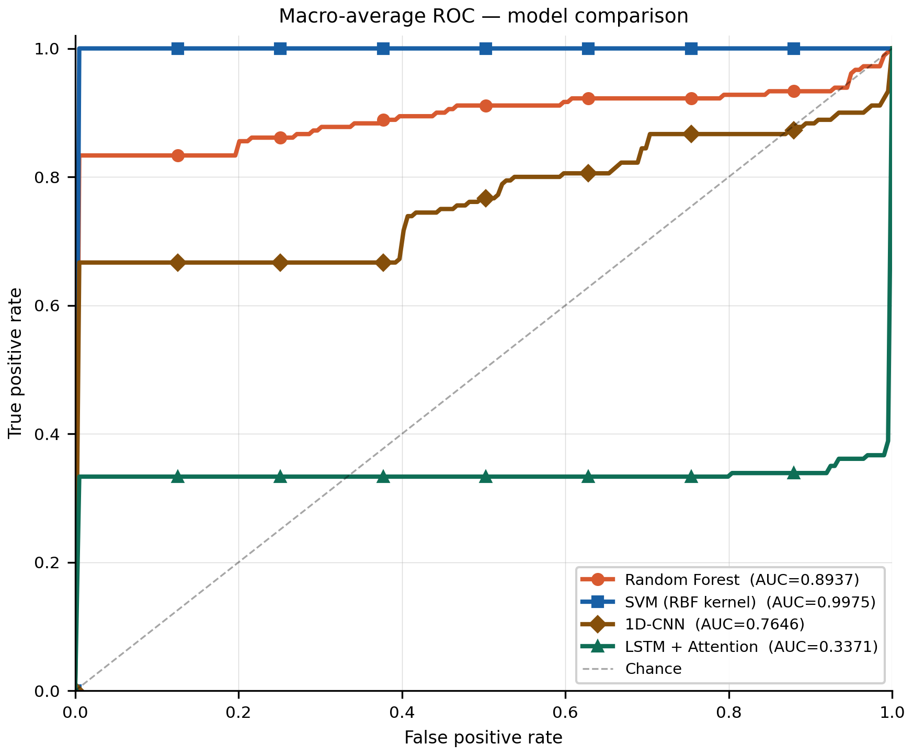
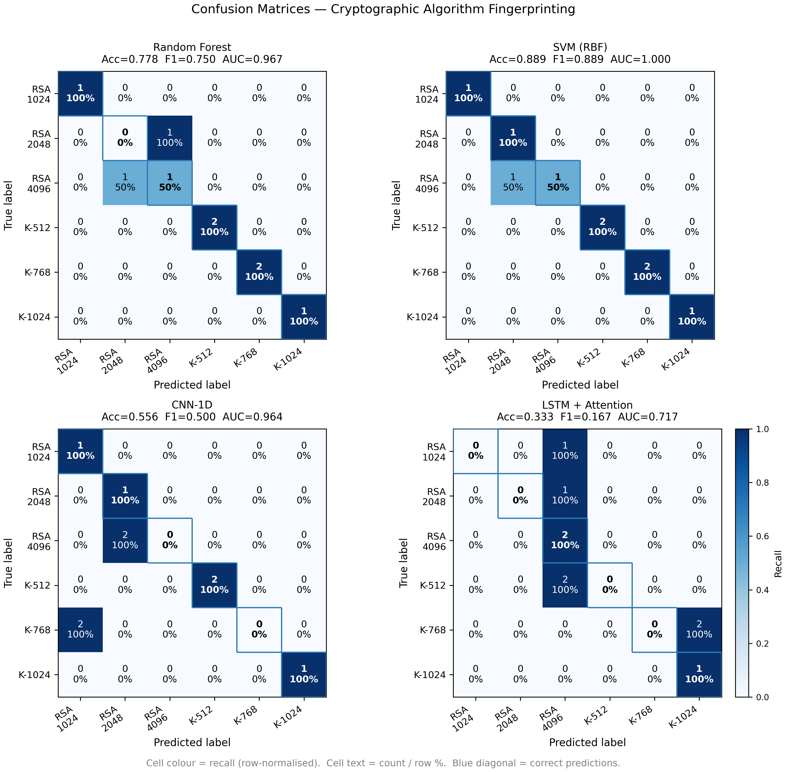
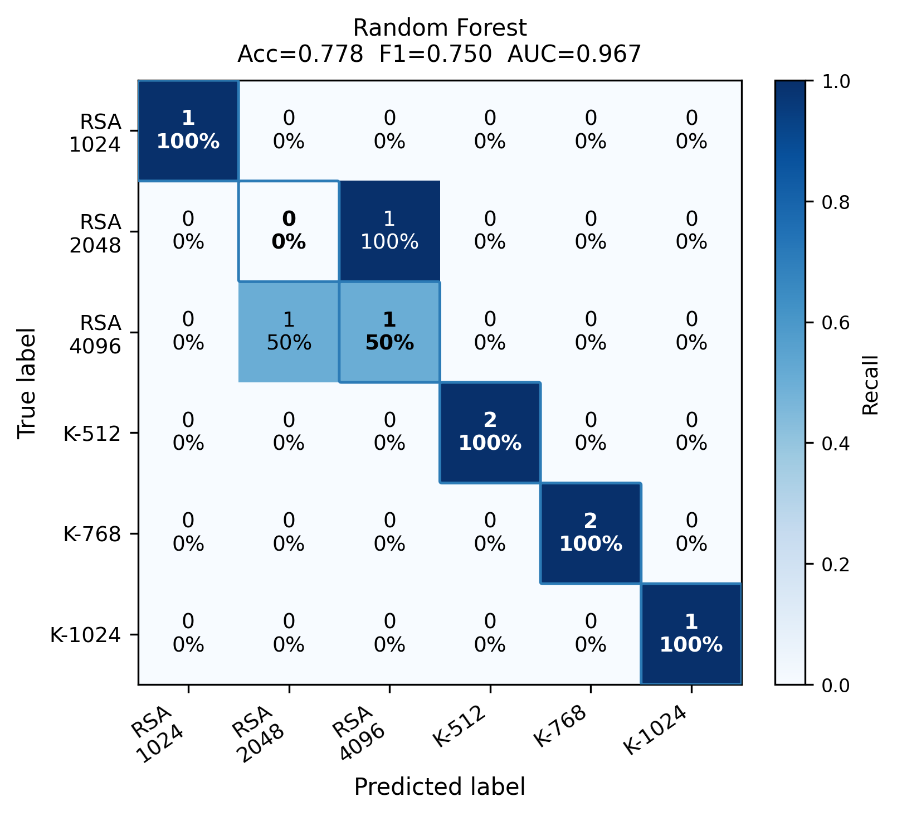
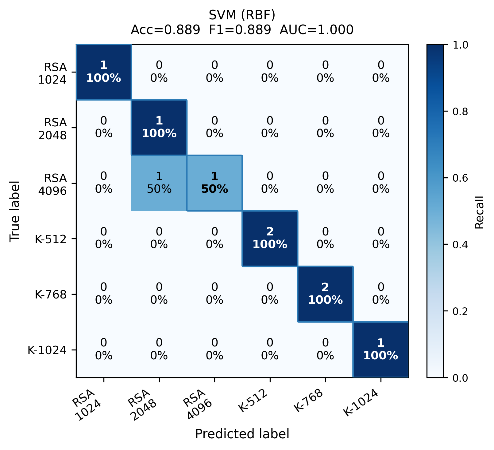
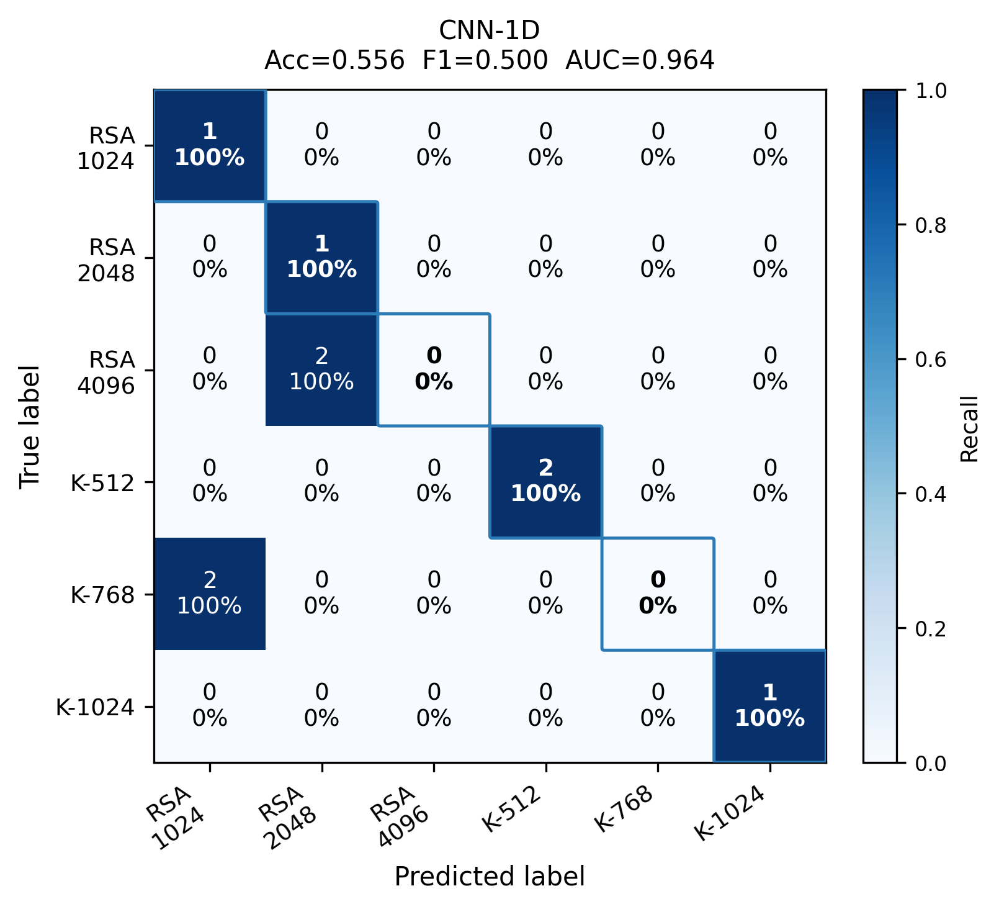
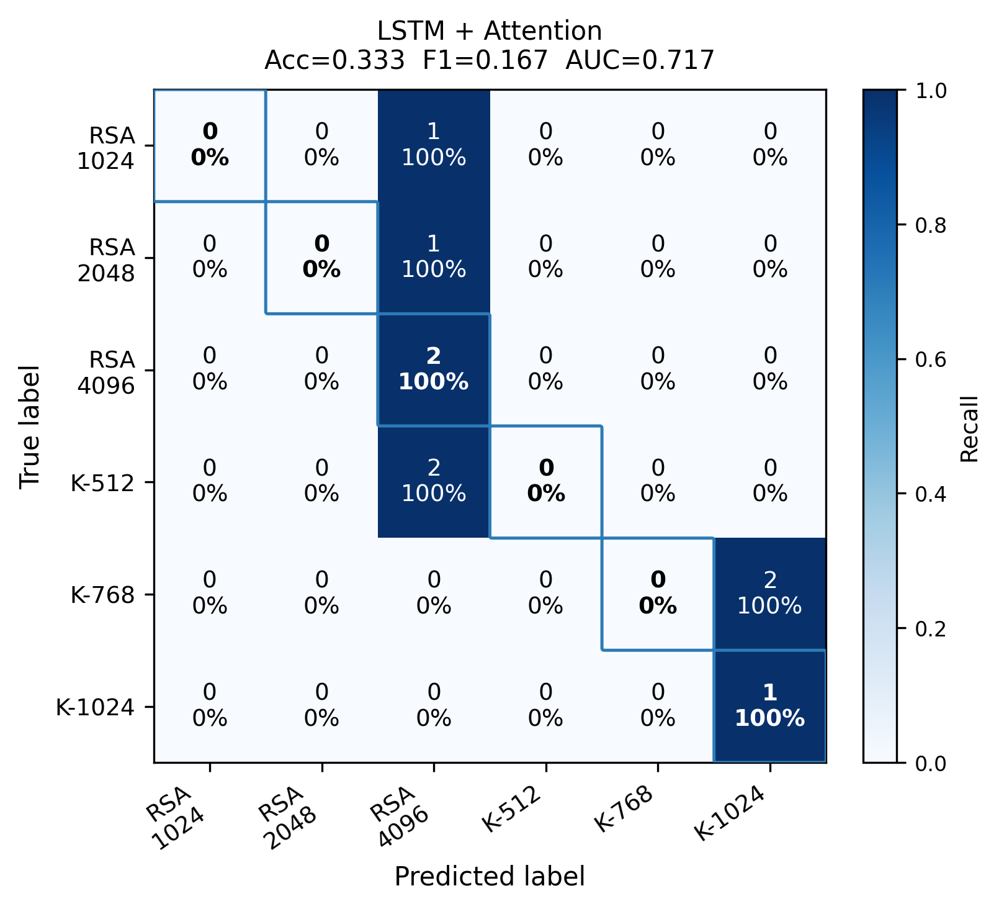
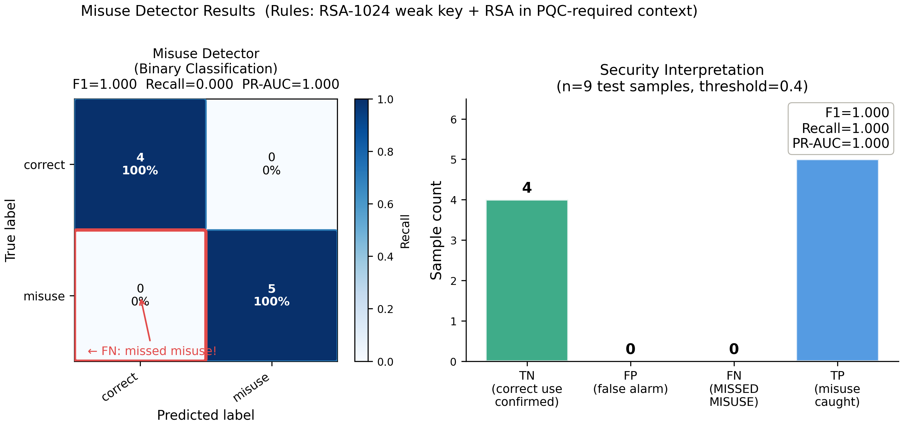
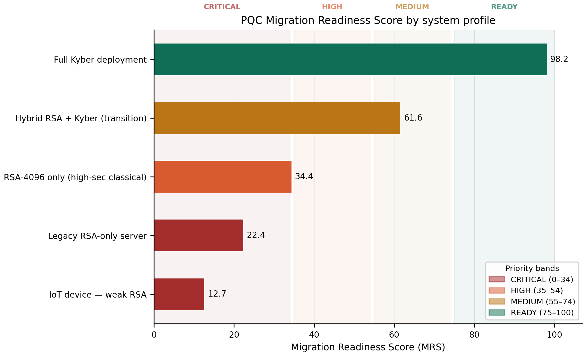

# CryptoFP 🔐

> **Passive cryptographic algorithm fingerprinting using runtime behavioral profiling and machine learning.**

CryptoFP identifies which cryptographic algorithm a system is running — RSA or post-quantum Kyber — purely from timing, memory, and CPU signals. No source code. No network access. No binary analysis.

---

## What It Does

Most cryptographic auditing tools require access to source code, binaries, or network traffic. CryptoFP takes a different approach: it watches how a system *behaves* at runtime and uses machine learning to fingerprint the algorithm from those behavioral patterns alone.

Beyond identification, CryptoFP also:
- **Detects misuse** — flags weak RSA-1024 keys and RSA usage in contexts that require post-quantum cryptography
- **Scores migration readiness** — produces a quantitative Post-Quantum Migration Readiness Score (MRS) to help organizations prioritize their PQC transition

---

## Algorithms Fingerprinted

| Classical | Post-Quantum (ML-KEM / CRYSTALS-Kyber) |
|---|---|
| RSA-1024 | Kyber-512 |
| RSA-2048 | Kyber-768 |
| RSA-4096 | Kyber-1024 |

---

## Models

| Model | Type | Notes |
|---|---|---|
| Random Forest | Tabular | Interpretable, strong baseline |
| SVM (RBF kernel) | Tabular | Best classification performance |
| CNN-1D | Deep learning | Local feature pattern extraction |
| BiLSTM + Bahdanau Attention | Deep learning | Sequential feature dependencies |
| Misuse Detector | Binary RF | Flags insecure deployments |

SVM achieved **88.89% accuracy**, **macro F1 = 0.889**, and **ROC-AUC = 1.000** on the prototype dataset. Misuse detection achieved **perfect precision, recall, and F1** across all test cases.

---

## Results

### Model Comparison — ROC Curves


### Confusion Matrices — All Models


<details>
<summary>Individual model confusion matrices</summary>

| Random Forest | SVM |
|---|---|
|  |  |

| CNN-1D | BiLSTM + Attention |
|---|---|
|  |  |

</details>

### Misuse Detection


### Post-Quantum Migration Readiness Scores


---

## Pipeline

```
Runtime Profiling → Feature Engineering → ML Classification → Misuse Detection → MRS Score
```

```
CryptoFP/
├── 01_data_collection/      # RSA + Kyber benchmarking under 4 load levels
├── 02_feature_engineering/  # 12-feature extraction, StandardScaler, SMOTE
├── 03_models/               # RF, SVM, CNN-1D, BiLSTM+Attention, misuse detector
├── 04_explainability/       # SHAP analysis, attention heatmaps
├── 05_results/              # Confusion matrices, ROC curves, MRS chart
├── config.py                # All settings in one place
└── run_pipeline.py          # Single command to run everything
```

---

## Quickstart

```bash
# 1. Install liboqs (required for Kyber benchmarks)
#    macOS:  brew install liboqs
#    Ubuntu: sudo apt install liboqs-dev

# 2. Install dependencies
pip install -r requirements.txt

# 3. Run full pipeline
python run_pipeline.py

# Or run a quick prototype (60 samples, ~12 seconds)
python run_pipeline.py --quick
```

Run individual phases:

```bash
python run_pipeline.py --only 1   # data collection only
python run_pipeline.py --from 2   # skip collection, start from feature engineering
```

---

## Post-Quantum Migration Readiness Score

CryptoFP computes an MRS (0–100) for any system profile based on four weighted components:

```
MRS = 100 × (0.40 × Algorithm + 0.25 × Key Strength + 0.20 × Timing Efficiency + 0.15 × Misuse Absence)
```

| Priority | MRS Range | Action |
|---|---|---|
| 🔴 CRITICAL | 0 – 34 | Immediate migration required |
| 🟠 HIGH | 35 – 54 | Migrate within 6 months |
| 🟡 MEDIUM | 55 – 74 | Migrate within 12 months |
| 🟢 READY | 75 – 100 | PQC-compliant, monitor only |

Example scores from built-in profiles:

| System | MRS | Priority |
|---|---|---|
| IoT device (RSA-1024 dominant) | 12.7 | 🔴 CRITICAL |
| Legacy RSA server | 22.4 | 🔴 CRITICAL |
| RSA-4096 only | 34.4 | 🟠 HIGH |
| Hybrid RSA + Kyber | 61.6 | 🟡 MEDIUM |
| Full Kyber deployment | 98.2 | 🟢 READY |

---

## Requirements

- Python 3.9 or 3.10
- liboqs C library (for Kyber benchmarks)
- PyTorch, scikit-learn, SHAP — see `requirements.txt`

---

## Paper

This repository accompanies the IEEE conference paper:

> **CryptoFP: ML-Based Cryptographic Algorithm Fingerprinting via Side-Channel Timing and Memory Profiling**
> Takshak Shetty, Gautami M, Shashank D Salian, Ashmi K Kotian
> NMAM Institute of Technology (NMAMIT), Nitte, India

---
